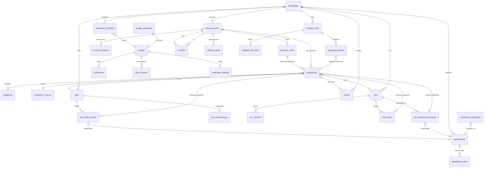

# Hestia

**One place for my household's finances and day-to-day management.**

A Flutter iOS app my family uses to centralize the money and logistics of running our home — accounts and transactions, the homes themselves, the people, the pets, the cars, and the recurring chores like shopping.

---

## Why this repo is public

This project is **source-available for my portfolio**, and to give other developers ideas for building their own household tools. **Only my family uses the deployed app** — it is not a product or a service for the public.

It is **not accepting issues or pull requests.** Read it, fork it, learn from it — but the tracker and PRs are closed. See [docs/ISSUES.md](docs/ISSUES.md) and [docs/PULL_REQUESTS.md](docs/PULL_REQUESTS.md).

## The problem it solves

Household money and household logistics usually live in a dozen disconnected apps and spreadsheets. Hestia pulls them into one place for the people who share a home:

- **Finances** — shared and personal bank accounts, cards, transactions, transfers, categories, balances, and savings goals.
- **Homes & members** — one or more homes, the people in each, and what they can see.
- **Shopping** — reusable list *templates* plus live shopping *sessions*, so a trip to the store is tracked as it happens and can be paid in one tap.
- **Pets** — health records and measurements per pet.
- **Cars** — vehicles, fuel entries, and per-car members.
- **Planning** — calendar, appointments, reminders, maps, and notifications.

## What it does

- Supabase backend (Auth, PostgREST, Realtime, Edge Functions, Storage) with row-level security
- Local SQLite cache via Drift for offline-friendly reads
- Firebase for crash reporting, analytics, and push
- In-app update prompts driven by an `app_versions` table populated on each release

## Stack

Flutter · BLoC · Supabase · Drift · Firebase · iOS (TestFlight)

> Backend detail: [supabase/README.md](supabase/README.md) · Full setup runbook: [supabase/SETUP.md](supabase/SETUP.md)

## Data model

Key constraints:

- `payment_cards.is_primary` — partial unique index: at most one primary card per account
- `transactions.payment_card_id` — nullable; card must belong to `bank_account_id`
- `google_credentials` — RLS deny-all for app users; only edge functions (service-role) can read refresh tokens
- Timestamps are **unix seconds** (`bigint`) everywhere except `appointments` (`timestamptz`)

## License

Source-available, all rights reserved. See [LICENSE](LICENSE).
